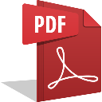

# Local PDF Tools

**Local PDF Tools** is a privacy-first Chrome extension that allows you to merge, split, and manage PDF files directly in your browser. All processing happens locally on your machine—your files are never uploaded to any server.

## 🚀 Features

- **Multi-Format Support**: Handle PDF, PNG, JPG, and WebP files in a single workspace.
- **Visual Page Management**:
  - **Drag & Drop Reordering**: Intuitively rearrange pages with a 2D spatial grid.
  - **Individual Page Rotation**: Rotate pages in 90-degree increments.
  - **Page Deletion**: Remove unnecessary pages before merging.
- **Powerful Export Options**:
  - **Merge & Export**: Combine multiple documents and images into a single, optimized PDF.
  - **Export as Images**: Convert every page in your workspace into high-quality PNG files.
  - **PDF Compression**: Optional object stream compression to keep file sizes manageable.
- **Live Previews**: Zoom into specific pages or preview the entire merged document before exporting.
- **Privacy Guaranteed**: Works entirely offline with no external data transmission.

## 🛠️ Installation (Developer Mode)

Since this extension is in development, you can load it as an unpacked extension:

1. Download or clone this repository to your local machine.
2. Open Google Chrome and navigate to `chrome://extensions/`.
3. Enable **Developer mode** using the toggle in the top-right corner.
4. Click the **Load unpacked** button.
5. Select the root folder of this project.

## 📖 How to Use

1. **Load Files**: Click the dropzone or drag and drop your PDF/Image files onto the dashboard.
2. **Organize**: Drag the page thumbnails to reorder them. Use the hover actions on each card to rotate or delete pages.
3. **Configure**: Enter your desired filename and toggle compression in the control panel.
4. **Preview**: Click "Preview PDF" to see how the final document will look.
5. **Generate**: Click "Merge & Export" to save your new PDF, or "Export All as Images" to save pages as PNGs.

## 📚 Credits & Libraries

This project leverages the following amazing open-source libraries:

- **[PDF.js](https://github.com/mozilla/pdf.js)** (by Mozilla)  
  Used for high-performance PDF rendering and text layer extraction.  
  *License: Apache 2.0*

- **[pdf-lib](https://github.com/Hopding/pdf-lib)** (by Andrew Ritrie)  
  Used for creating and modifying PDF documents, including merging pages and embedding images.  
  *License: MIT*

- **[Plus Jakarta Sans](https://fonts.google.com/specimen/Plus+Jakarta+Sans)** (by Tokotype)  
  The modern, geometric typeface used for the UI.  
  *License: SIL Open Font License*

---

Built with ❤️ for privacy and productivity.
